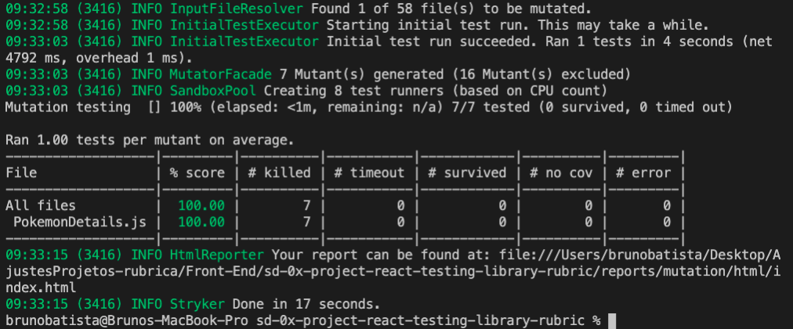
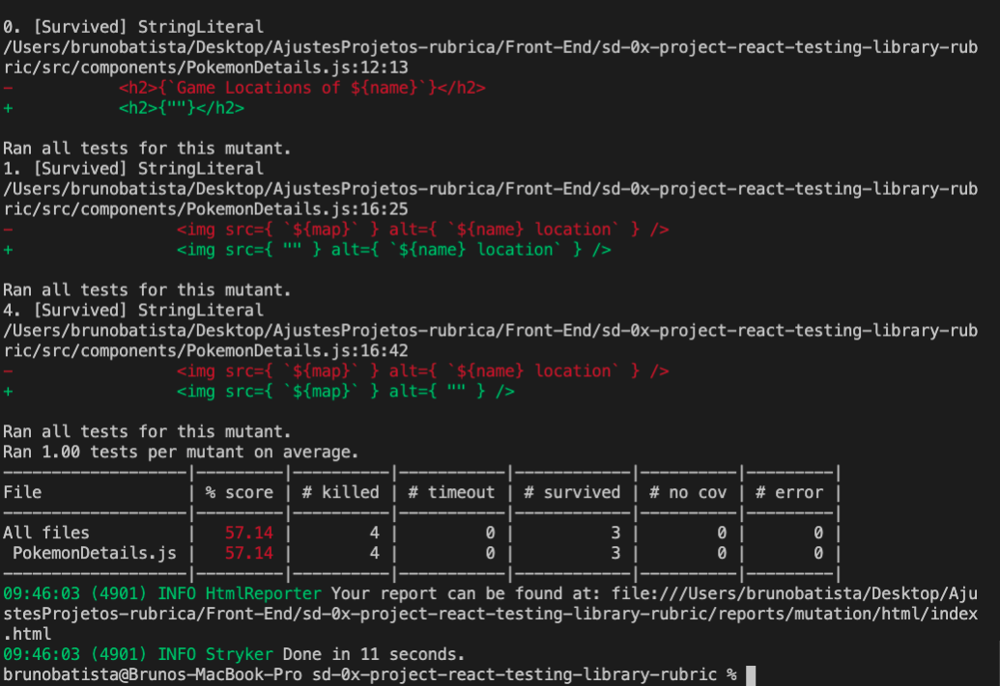

# Boas-vindas ao repositório do projeto de testes com a React Testing Library!

Para realizar o projeto, atente-se a cada passo descrito a seguir e, se tiver qualquer dúvida, nos envie por _Slack_! #vqv 🚀

Aqui você vai encontrar os detalhes de como estruturar o desenvolvimento do seu projeto a partir deste repositório, utilizando uma branch específica e um _Pull Request_ para colocar seus códigos.

# Termos e acordos

Ao iniciar este projeto, você concorda com as diretrizes do Código de Conduta e do Manual da Pessoa Estudante da Trybe.

# Entregáveis

<details>
  <summary><strong>🤷🏽‍♀️ Como entregar</strong></summary><br />

  Para entregar o seu projeto você deverá criar um *Pull Request* neste repositório.

  Lembre-se que você pode consultar nosso conteúdo sobre [Git & GitHub](https://app.betrybe.com/course/4d67f5b4-34a6-489f-a205-b6c7dc50fc16/) e nosso [Blog - Git & GitHub](https://blog.betrybe.com/tecnologia/git-e-github/) sempre que precisar!
</details>

<details>
  <summary><strong>👨‍💻 O que deverá ser desenvolvido</strong></summary><br />

  - Nesse projeto você escreverá testes para uma aplicação React que já está criada e configurada, utilizando [`Jest`](https://jestjs.io/) e a biblioteca [`React Testing Library`](https://testing-library.com/). Você não precisará realizar nenhuma configuração adicional.
 
  - A aplicação contém uma implementação completa de todos os requisitos da Pokédex. Seu trabalho será, para cada requisito listado, escrever testes que garantam sua corretude. Cuidado com [testes _falsos positivos_](https://talkingabouttesting.com/2015/08/04/falsos-negativos-falsos-positivos-verdadeiros-negativos-e-verdadeiros-positivos/). Falsos positivos serão desconsiderados na avaliação.
</details>

<details>
  <summary><strong>:memo: Habilidades</strong></summary><br />

  Neste projeto, verificamos se você é capaz de:

  * Utilizar os seletores (queries) da React-Testing-Library em testes automatizados;

  * Simular eventos com a React-Testing-Library em testes automatizados;

  * Testar fluxos lógicos assíncronos com a React-Testing-Library;

  * Escrever testes que permitam a refatoração da estrutura dos componentes da aplicação sem necessidade de serem alterados;

  * Testar inputs.
</details>

<details>
  <summary><strong>🗓 Data de Entrega</strong></summary><br />
  
  * Este projeto é individual;
  * São `X` dias de projeto;
  * Data para entrega final do projeto: `DD/MM/YYYY - 14:00h`.

</details>

# Orientações

<details>
  <summary><strong>‼️ Antes de começar a desenvolver</strong></summary><br />

  1. Clone o repositório

  - Use o comando: `git clone git@github.com:tryber/sd-0x-project-react-testing-library.git`.
  - Entre na pasta do repositório que você acabou de clonar:
    - `cd sd-0x-project-react-testing-library`

  2. Instale as dependências

  - `npm install`.
  
  3. Crie uma branch a partir da branch `master`

  - Verifique que você está na branch `master`
    - Exemplo: `git branch`
  - Se não estiver, mude para a branch `master`
    - Exemplo: `git checkout master`
  - Agora crie uma branch à qual você vai submeter os `commits` do seu projeto
    - Você deve criar uma branch no seguinte formato: `nome-de-usuario-nome-do-projeto`
    - Exemplo: `git checkout -b joaozinho-sd-0x-project-react-testing-library`

  4. Adicione as mudanças ao _stage_ do Git e faça um `commit`

  - Verifique que as mudanças ainda não estão no _stage_
    - Exemplo: `git status` (deve aparecer listada a pasta _joaozinho_ em vermelho)
  - Adicione o novo arquivo ao _stage_ do Git
    - Exemplo:
      - `git add .` (adicionando todas as mudanças - _que estavam em vermelho_ - ao stage do Git)
      - `git status` (deve aparecer listado o arquivo _joaozinho/README.md_ em verde)
  - Faça o `commit` inicial
    - Exemplo:
      - `git commit -m 'iniciando o projeto x'` (fazendo o primeiro commit)
      - `git status` (deve aparecer uma mensagem tipo _nothing to commit_ )

  5. Adicione a sua branch com o novo `commit` ao repositório remoto

  - Usando o exemplo anterior: `git push -u origin joaozinho-sd-0x-project-react-testing-library`

  6. Crie um novo `Pull Request` _(PR)_

  - Vá até a página de _Pull Requests_ do [repositório no GitHub](https://github.com/tryber/sd-0x-project-react-testing-library/pulls)
  - Clique no botão verde _"New pull request"_
  - Clique na caixa de seleção _"Compare"_ e escolha a sua branch **com atenção**
  - Coloque um título para a sua _Pull Request_
    - Exemplo: _"Cria tela de busca"_
  - Clique no botão verde _"Create pull request"_
  - Adicione uma descrição para o _Pull Request_ e clique no botão verde _"Create pull request"_
  - **Não se preocupe em preencher mais nada por enquanto!**
  - Volte até a [página de _Pull Requests_ do repositório](https://github.com/tryber/sd-0x-project-react-testing-library/pulls) e confira que o seu _Pull Request_ está criado

</details>

<details>
  <summary><strong>⌨️ Durante o desenvolvimento</strong></summary><br />

  - Faça `commits` das alterações que você fizer no código regularmente

  - Lembre-se de sempre após um (ou alguns) `commits` atualizar o repositório remoto

  - Os comandos que você utilizará com mais frequência são:
    1. `git status` _(para verificar o que está em vermelho - fora do stage - e o que está em verde - no stage)_
    2. `git add` _(para adicionar arquivos ao stage do Git)_
    3. `git commit` _(para criar um commit com os arquivos que estão no stage do Git)_
    4. `git push -u origin nome-da-branch` _(para enviar o commit para o repositório remoto na primeira vez que fizer o `push` de uma nova branch)_
    5. `git push` _(para enviar o commit para o repositório remoto após o passo anterior)_

</details>

<details>
  <summary><strong>🤝 Depois de terminar o desenvolvimento (opcional)</strong></summary><br />

  Para sinalizar que o seu projeto está pronto para o _"Code Review"_, faça o seguinte:

  - Vá até a página **DO SEU** _Pull Request_, adicione a label de _"code-review"_ e marque seus colegas:

    - No menu à direita, clique no _link_ **"Labels"** e escolha a _label_ **code-review**;

    - No menu à direita, clique no _link_ **"Assignees"** e escolha **o seu usuário**;

    - No menu à direita, clique no _link_ **"Reviewers"** e digite `students`, selecione o time `tryber/students-sd-0x`.

  Caso tenha alguma dúvida, [aqui tem um video explicativo](https://vimeo.com/362189205).

</details>

<details>
  <summary><strong>🕵🏿 Revisando um pull request</strong></summary><br />

  Use o conteúdo sobre [Code Review](https://course.betrybe.com/real-life-engineer/code-review/) para te ajudar a revisar os _Pull Requests_.

</details>

<details>
  <summary><strong>🎛 Linter</strong></summary><br />

  Para garantir a qualidade do código, vamos utilizar neste projeto os linters `ESLint` e `StyleLint`.
  Assim o código estará alinhado com as boas práticas de desenvolvimento, sendo mais legível
  e de fácil manutenção! Para rodá-los localmente no projeto, execute os comandos abaixo:

  ```bash
    npm run lint
    npm run lint:styles
  ```

  ⚠️ **PULL REQUESTS COM ERROS DE LINTER NÃO SERÃO AVALIADAS.
  ATENTE-SE PARA RESOLVÊ-LAS ANTES DE FINALIZAR O DESENVOLVIMENTO!** ⚠️

  Em caso de dúvidas, confira o material do course sobre [ESLint e Stylelint](https://app.betrybe.com/course/real-life-engineer/eslint).
</details>

<details>
  <summary><strong>🛠 Testes</strong></summary><br />

  Neste projeto você desenvolverá os testes de uma aplicação React. Mas então, como será avaliado?

  ### Quem testa os testes?

  O avaliador automatizado **testará os testes de vocês!** A ideia dele é a seguinte: você vai escrever casos de teste para a aplicação, certo? E esses testes têm que garantir que a aplicação está funcionando, certo? Pois bem! Se eu quebro uma parte da aplicação, fazendo uma alteração no código, seus testes devem quebrar, certo? Pois é isso que o avaliador faz!

  Mas como assim? :thinking: 
  
  Pense da seguinte forma: nosso avaliador vai navegar por toda a aplicação da Pokédex e vai fazer várias mudanças no código **para que ela quebre e pare de funcionar**. Em seguida ele vai rodar seus testes. Caso seus testes não acusem que a aplicação está com problemas, o avaliador não vai aprovar aquele requisito! Se, para todas as alterações que o avaliador fizer no código da aplicação, os seus testes acusarem problemas, tudo será aprovado! O avaliador garante, portanto, que seus testes, de fato, testam a aplicação da Pokédex como se deve.
  
  Na linguagem do avaliador, dizemos que cada mudança que o avaliador faz na sua aplicação é um **mutante**. O avaliador cria vários mutantes e seus testes **devem matar todos!** Se algum mutante sobreviver, temos problemas. Certo? Vamos aos requisitos então!

  ### Executando os testes localmente

  - Há uma pasta chamada `./stryker` com diversos arquivos `nomeArquivo.conf.json`. Cada um deles é a configuração do avaliador para um requisito e ela **não deve ser alterada**. 
  
  - Após finalizar os testes unitários de um arquivo, para testá-lo individualmente, execute o comando abaixo:
  ```bash
  npx stryker run ./stryker/nomeDoArquivo.conf.json
  ```

  - Por exemplo:
    - Passo 1: _"Acabei de fazer os testes unitários do arquivo `PokemonDetails.test.js`!"_
    - Passo 2: _"Vou rodar os meus testes para ver se eles estão todos passando!"_
    - Passo 3: _"Agora vou rodar o comando para o requisito com `npx stryker run ./stryker/PokemonDetails.conf.json`!"_
    * Com o comando acima, ele vai executar o Stryker e verificar se os seus testes unitários estão corretos.

  - Quando o comando `npx stryker run ./stryker/PokemonDetails.conf.json` for executado, com todos os testes passando, o avaliador apresentará uma saída semelhante à abaixo.

    
    
  - Uma falha ocorre quando os testes unitários não cobrem 100% de caso de uso gerados pelo Stryker. Nesse caso, algo semelhante à imagem abaixo aparecerá.

    
    
  * Repare que, na tabela, 4 casos de uso constam como `Killed` e 3 constam como `Survived`. Isso significa que **3 casos de uso não foram contemplados pelos seus testes**! Os casos de uso, que geraram os erros, aparecem acima. Na linha verde (ao lado de cada símbolo `+`), o Stryker exibe o erro que ele injetou no teste para testar um caso de uso. Esse erro não foi coberto pelo seu teste.

  ⚠️ **O avaliador automático não necessariamente avalia seu projeto na ordem em que os requisitos aparecem no readme. Isso acontece para deixar o processo de avaliação mais rápido. Então, não se assuste se isso acontecer, ok?**
</details>

<details>
  <summary><strong>:convenience_store: Desenvolvimento </strong></summary><br />

  Neste projeto você irá desenvolver os testes de uma Pokédex, desenvolvida em React. Lembre-se que para a avaliação utilizaremos testes por mutação, então cada requisito só será aceito se os testes possuírem comportamento adequado tanto na aplicação original como na modificada.

  ⚠ PULL REQUESTS COM ERROS NO LINTER NÃO SERÃO AVALIADAS, ATENTE-SE PARA RESOLVÊ-LAS ANTES DE FINALIZAR O DESENVOLVIMENTO! ⚠

  - **Cada requisito se refere a um arquivo da aplicação da Pokédex**. Obter aprovação num requisito significa que todos os casos de erro daquele arquivo estão cobertos, ou seja, todos os mutantes criados naquele arquivo pelo avaliador foram mortos. Nos subitens de cada requisito está detalhado o que é necessário para obter a aprovação neles.

  - Todos os arquivos de teste que vocês usarão **já estão previamente criados** e **novos arquivos não devem ser criados**. Como exemplo, para testar o componente `<App.js />`, vocês deverão desenvolver o teste dentro do arquivo `src/tests/App.test.js`.

  - A implementação da Pokédex já está 100% funcional.

  -  ⚠ Os únicos arquivos que precisam ser alterados são os arquivos de teste que estão dentro da pasta `src/tests`. Para que você não tenha problemas com o avaliador remoto, **não modifique os demais arquivos da pasta `src` e nem o `App.js`**. ⚠

  :bulb: **Observe que nem todos os testes são contemplados em sua totalidade pelo avaliador, mas é importante tentar realizar todos os testes de cada requisito a seguir, pois eles são relevantes para os cenários apresentados e vão colocar em prática os conhecimentos de RTL que você adquiriu até aqui!** :smile:
</details>

<details>
  <summary><strong>🗣 Nos dê feedbacks sobre o projeto!</strong></summary><br />

Ao finalizar e submeter o projeto, não se esqueça de avaliar sua experiência preenchendo o formulário. 
**Leva menos de 3 minutos!**

[FORMULÁRIO DE AVALIAÇÃO DE PROJETO](https://be-trybe.typeform.com/to/ZTeR4IbH)

</details>

<details>
  <summary><strong>🗂 Compartilhe seu portfólio!</strong></summary><br />

  Você sabia que o LinkedIn é a principal rede social profissional e compartilhar o seu aprendizado lá é muito importante para quem deseja construir uma carreira de sucesso? Compartilhe esse projeto no seu LinkedIn, marque o perfil da Trybe (@trybe) e mostre para a sua rede toda a sua evolução.

</details>

# Requisitos

:warning: **PULL REQUESTS COM ERROS DE LINTER NÃO SERÃO AVALIADAS.** :warning:

## 1. Teste o componente `<App.js />`

  > Caminho do componente: `src/App.js`

- <details><summary>Teste se o topo da aplicação contém um conjunto fixo de links de navegação:</summary>

  - O primeiro link deve possuir o texto `Home`;

  - O segundo link deve possuir o texto `About`;

  - O terceiro link deve possuir o texto `Favorite Pokémons`.
</details>

- Teste se a aplicação é redirecionada para a página inicial, na URL `/` ao clicar no link `Home` da barra de navegação;

- Teste se a aplicação é redirecionada para a página de `About`, na URL `/about`, ao clicar no link `About` da barra de navegação;

- Teste se a aplicação é redirecionada para a página de `Pokémons Favoritados`, na URL `/favorites`, ao clicar no link `Favorite Pokémons` da barra de navegação;

- Teste se a aplicação é redirecionada para a página `Not Found` ao entrar em uma URL desconhecida.

<details>
  <summary><strong>O que será verificado</strong></summary><br />

  * Será avaliado se o arquivo teste `App.test.js` contempla 100% dos casos de uso criados pelo Stryker:
    * É exibido na tela um `link` com o texto `Home`
    * É exibido na tela um `link` com o texto `About`
    * É exibido na tela um `link` com o texto `Favorite Pokémons`
</details>

---

## 2. Teste o componente `<About.js />.`

  > Caminho do componente: `src/pages/About.js`

  - Teste se a página contém as informações sobre a Pokédex;

  - Teste se a página contém um heading `h2` com o texto `About Pokédex`;

  - Teste se a página contém dois parágrafos com texto sobre a Pokédex;

  - Teste se a página contém a seguinte imagem de uma Pokédex: `https://cdn2.bulbagarden.net/upload/thumb/8/86/Gen_I_Pok%C3%A9dex.png/800px-Gen_I_Pok%C3%A9dex.png`.

  <details>
  <summary><strong>O que será verificado</strong></summary><br />

  * Será avaliado se o arquivo teste `About.test.js` contempla 100% dos casos de uso criados pelo Stryker:
    * É exibido na tela um `h2` com texto `About Pokédex`
    * O atributo `src` da imagem é `https://cdn2.bulbagarden.net/upload/thumb/8/86/Gen_I_Pok%C3%A9dex.png/800px-Gen_I_Pok%C3%A9dex.png`
  </details>

---

## 3. Teste o componente `<FavoritePokemons.js />`

  > Caminho do componente: `src/pages/FavoritePokemons.js`
  
  - Teste se é exibida na tela a mensagem `No favorite pokemon found`, caso a pessoa não tenha pokémons favoritos;

  - Teste se são exibidos todos os cards de pokémons favoritados.

  <details>
  <summary><strong>O que será verificado</strong></summary><br />

  * Será avaliado se o arquivo teste `FavoritePokemons.test.js` contempla 100% dos casos de uso criados pelo Stryker:
    * É exibido na tela a mensagem `No favorite pokemon found`
  </details>

---

## 4. Teste o componente `<NotFound.js />`

  > Caminho do componente: `src/pages/NotFound.js`

  - Teste se a página contém um heading `h2` com o texto `Page requested not found`;

  - Teste se a página mostra a imagem `https://media.giphy.com/media/kNSeTs31XBZ3G/giphy.gif`.

  <details>
  <summary><strong>O que será verificado</strong></summary><br />

  * Será avaliado se o arquivo teste `NotFound.test.js` contempla 100% dos casos de uso criados pelo Stryker:
    * É exibido na tela um `h2` com o texto `Page requested not found`
    * Existe uma imagem com o `src` `https://media.giphy.com/media/kNSeTs31XBZ3G/giphy.gif`
  </details>

---

## 5. Teste o componente `<Pokedex.js />`

  > Caminho do componente: `src/pages/Pokedex.js`

  - Teste se a página contém um heading `h2` com o texto `Encountered pokémons`;

  - <details><summary>Teste se é exibido o próximo pokémon da lista quando o botão <code>Próximo pokémon</code> é clicado:</summary>

    - O botão deve conter o texto `Próximo pokémon`;

    - Os próximos pokémons da lista devem ser mostrados, um a um, ao clicar sucessivamente no botão;

    - O primeiro pokémon da lista deve ser mostrado ao clicar no botão, se estiver no último pokémon da lista.
  </details>

  - Teste se é mostrado apenas um pokémon por vez;

  - <details><summary>Teste se a Pokédex tem os botões de filtro:</summary>

    - Deve existir um botão de filtragem para cada tipo de pokémon, sem repetição;
      - _obs: Os botões devem ser capturados pelo `data-testid=pokemon-type-button`_ 

    - A partir da seleção de um botão de tipo, a Pokédex deve circular somente pelos pokémons daquele tipo;

    - O texto do botão deve corresponder ao `nome do tipo`, ex. `Psychic`;

    - O botão `All` precisa estar **sempre** visível.
  </details>

  - <details><summary>Teste se a Pokédex contém um botão para resetar o filtro:</summary>

    - O texto do botão deve ser `All`;

    - A Pokedéx deverá mostrar os pokémons normalmente (sem filtros) quando o botão `All` for clicado;

    - Ao carregar a página, o filtro selecionado deverá ser `All`.
  </detail>

  <details>
  <summary><strong>O que será verificado</strong></summary><br />

  * Será avaliado se o arquivo teste `Pokedex.test.js` contempla 100% dos casos de uso criados pelo Stryker:
    * Os botões de filtragem por tipo possuem o nome correto
    * Os botões de filtragem por tipo possuem o `data-testid=pokemon-type-button` exceto o botão `All`
    * É possível clicar no botão de filtragem `All`
  </details>

---

## 6. Teste o componente `<Pokemon.js />`

  > Caminho do componente: `src/components/Pokemon.js`

  - <details><summary>Teste se é renderizado um card com as informações de determinado pokémon:</summary>

    - O nome correto do pokémon deve ser mostrado na tela;

    - O tipo correto do pokémon deve ser mostrado na tela;

    - O peso médio do pokémon deve ser exibido com um texto no formato `Average weight: <value> <measurementUnit>`; onde `<value>` e `<measurementUnit>` são, respectivamente, o peso médio do pokémon e sua unidade de medida;

    - A imagem do pokémon deve ser exibida. Ela deve conter um atributo `src` com a URL da imagem e um atributo `alt` com o texto `<name> sprite`, onde `<name>` é o nome do pokémon.
  </details>

  - Teste se o card do pokémon indicado na Pokédex contém um link de navegação para exibir detalhes deste pokémon. O link deve possuir a URL `/pokemons/<id>`, onde `<id>` é o id do pokémon exibido;

  - Teste se ao clicar no link de navegação do pokémon, é feito o redirecionamento da aplicação para a página de detalhes de pokémon;
  
  - Teste também se a URL exibida no navegador muda para `/pokemon/<id>`, onde `<id>` é o id do pokémon cujos detalhes se deseja ver;

  - <details><summary>Teste se existe um ícone de estrela nos pokémons favoritados:</summary>

    - O ícone deve ser uma imagem com o atributo `src` contendo o caminho `/star-icon.svg`;

    - A imagem deve ter o atributo `alt` igual a `<pokemon> is marked as favorite`, onde `<pokemon>` é o nome do pokémon exibido.
  </details>

  <details>
  <summary><strong>O que será verificado</strong></summary><br />

  * Será avaliado se o arquivo teste `Pokemon.test.js` contempla 100% dos casos de uso criados pelo Stryker:
    * A imagem do pokemon possui o `src` correto
    * A imagem do pokemon possui o `alt` `<name> sprite`
    * A imagem de favorito :star: possui o `src` `/star-icon.svg`
    * A imagem de favorito :star: possui o `alt` `<name> is marked as favorite`
    * É exibido na tela um texto com o tipo do pokemon
    * É exibido na tela um `link` com o `href` `/pokemons/<id>`
  </details>

---

## 7. Teste o componente `<PokemonDetails.js />`

  > Caminho do componente: `src/pages/PokemonDetails.js`

  - <details><summary>Teste se as informações detalhadas do pokémon selecionado são mostradas na tela:</summary>

    - A página deve conter um texto `<name> Details`, onde `<name>` é o nome do pokémon;

    - **Não** deve existir o link de navegação para os detalhes do pokémon selecionado;

    - A seção de detalhes deve conter um heading `h2` com o texto `Summary`;

    - A seção de detalhes deve conter um parágrafo com o resumo do pokémon específico sendo visualizado.
      - _obs: é possível utilizar regex para capturar o parágrafo_
  </details>

  - <details><summary>Teste se existe na página uma seção com os mapas contendo as localizações do pokémon:</summary>

    - Na seção de detalhes deverá existir um heading `h2` com o texto `Game Locations of <name>`; onde `<name>` é o nome do pokémon exibido;

    - Todas as localizações do pokémon devem ser mostradas na seção de detalhes;

    - Devem ser exibidos o nome da localização e uma imagem do mapa em cada localização;

    - A imagem da localização deve ter um atributo `src` com a URL da localização;

    - A imagem da localização deve ter um atributo `alt` com o texto `<name> location`, onde `<name>` é o nome do pokémon.
  </details>

  - <details><summary>Teste se o usuário pode favoritar um pokémon através da página de detalhes:</summary>

    - A página deve exibir um `checkbox` que permite favoritar o pokémon;

    - Cliques alternados no `checkbox` devem adicionar e remover respectivamente o pokémon da lista de favoritos;

    - O `label` do `checkbox` deve conter o texto `Pokémon favoritado?`.
  </details>
  
  <details>
  <summary><strong>O que será verificado</strong></summary><br />

  * Será avaliado se o arquivo teste `PokemonDetails.test.js` contempla 100% dos casos de uso criados pelo Stryker:
    * É exibido na tela um `h2` com o texto `<name> Details`
    * É exibido na tela um `h2` com o texto `Summary`
    * É exibido na tela um texto contendo `<summary>`
    * É exibido na tela um `h2` com o texto `Game Locations of <name>`
    * São exibidas na tela imagens de localização com o `src` correto
    * É exibido na tela uma `label` com o texto `Pokémon favoritado?`
  </details>

---

# Requisitos não avaliativos

O que temos a seguir não são requisitos bônus - são ideias para você se aprofundar mais no projeto e **aprender mais!** Que tal trabalhar neles? Começamos com algo bem direto:

  <details>
  <summary><strong>A cobertura de testes deve ser 100%</strong></summary>

  - Para ver a cobertura de testes, execute no terminal o comando `npm run test-coverage`.
  </details>

Além disso, a Pokédex é uma aplicação estática, com seus dados pré-definidos. Utilizando a [PokéAPI](https://pokeapi.co/), é possível deixá-la mais dinâmica e realista.

Implemente os requisitos propostos a seguir e escreva testes para eles. Tente manter sempre a cobertura de testes em 100%, garantindo assim que não há código ou fluxos lógicos não testados. Para um desafio adicional, tente utilizar TDD - escreva os testes à medida que for implementando os requisitos.

  - <details><summary>Adicione uma rota para exibir uma lista de localizações</summary>

    - A URL da rota deve ser `/locations`;

    - A página deve exibir uma lista com as localizações retornadas pela PokéAPI. Você pode ler [aqui](https://pokeapi.co/docs/v2#resource-lists-section) e [aqui](https://pokeapi.co/docs/v2#locations-section) como utilizar a PokéAPI para buscar uma lista de localizações.
  </details>

  - <details><summary>Adicione na barra de navegação um link para a lista de localizações</summary>

    - O link deve conter o texto `Locations`;

    - Ao clicar no link, a página com a lista de localizações deve ser exibida.
  </details>

  - <details><summary>Adicione botões de paginação na lista de localizações.</summary>

    Por padrão, os _endpoints_ da PokéAPI retornam no máximo 20 resultados. Utilizando os parâmetros `limit` e `offset`, você pode especificar qual página deseja buscar e qual seu tamanho. Veja [aqui](https://pokeapi.co/docs/v2#resource-lists-section) como utilizar estes parâmetros.

    - Adicione dois botões "Anterior" e "Próxima" que permitam navegar entre as página da lista de localizações;

    - Na primeira página, o botão "Anterior" deve ser desabilitado. Da mesma forma, ao alcançar a última página, o botão "Próximo" deve ser desabilitado.
  </details>

  - <details><summary>Adiciona uma rota para exibir uma lista de gerações.</summary>

    - A URL da rota deve ser `/generations`;

    - A página deve exibir uma lista com as gerações retornadas pela PokéAPI. Você pode ler [aqui](https://pokeapi.co/docs/v2#resource-lists-section) e [aqui](https://pokeapi.co/docs/v2#generations) como utilizar a PokéAPI para buscar uma lista de gerações.
  </details>

  - <details><summary>Adicione na barra de navegação um link para a lista de gerações</summary>

    - O link deve conter o texto `Generations`;

    - Ao clicar no link, a página com a lista de gerações deve ser exibida.
  </details>

  - <details><summary>Adicione uma rota para exibir informações sobre uma geração</summary>

    - A URL da rota deve ser `/generations/<id>`, onde `<id>` é o id da geração exibida;

    - A página deve exibir, após buscar na PokéAPI, o nome da geração e uma lista com os nomes dos pokémons introduzidos nesta geração.
  </details>

  - <details><summary>Adicione a cada geração na lista de gerações um link para a página de detalhes desta geração</summary>

    - Ao clicar no link, a página com informações sobre a geração clicada deve ser exibida.
  </details>

---
